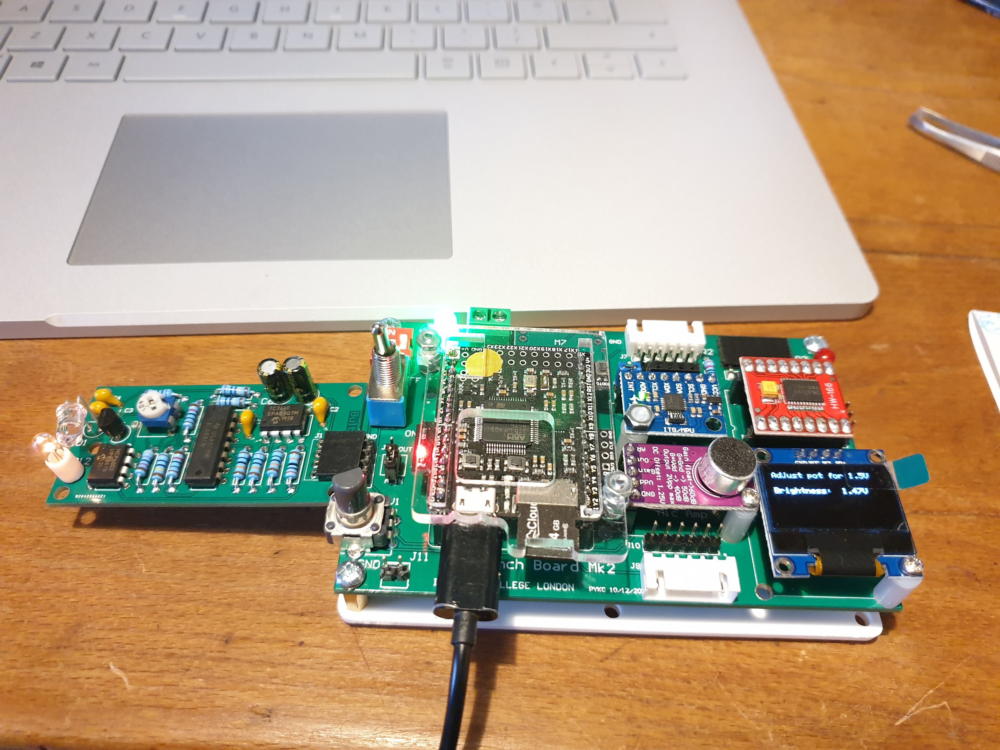
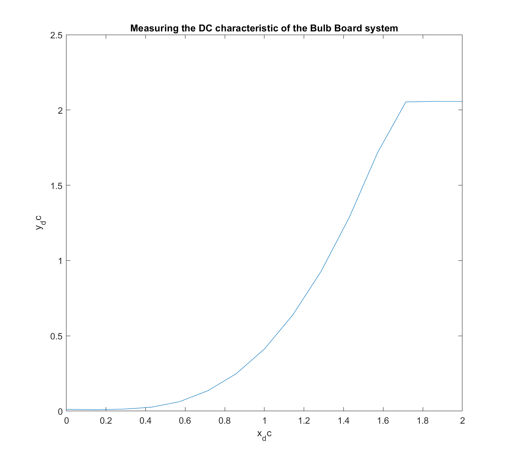
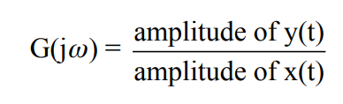
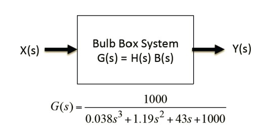
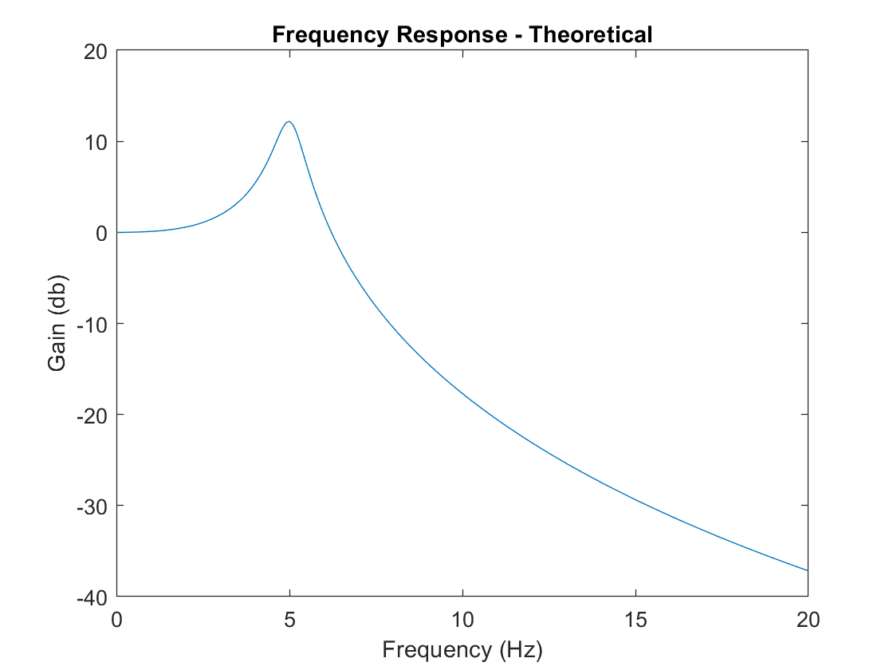
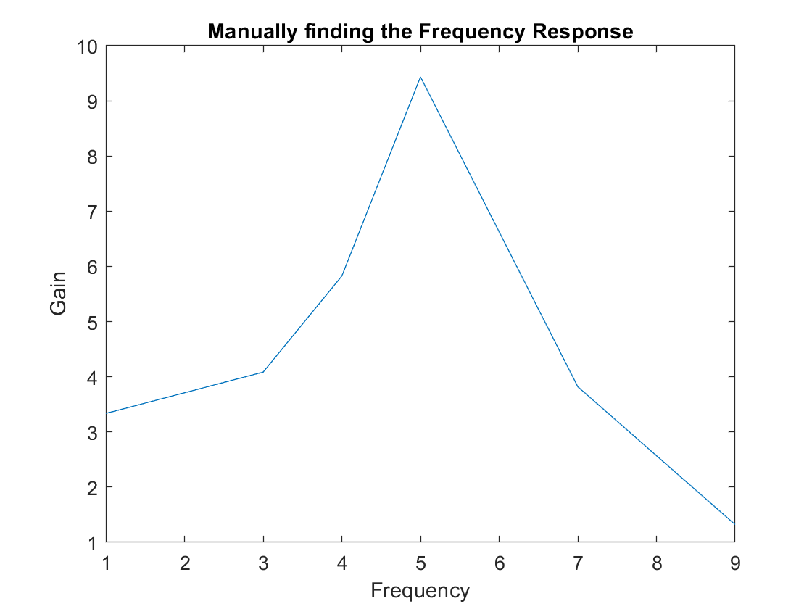
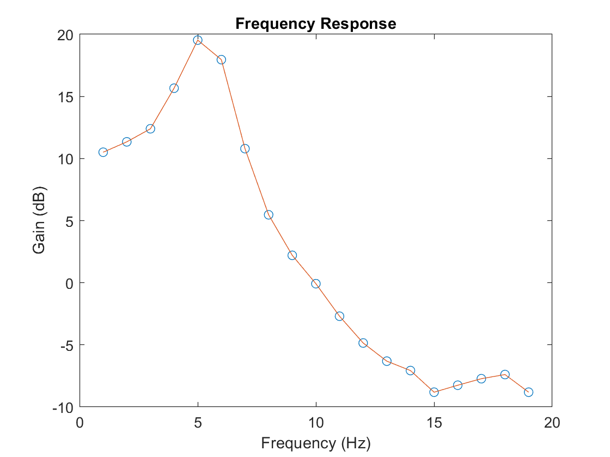
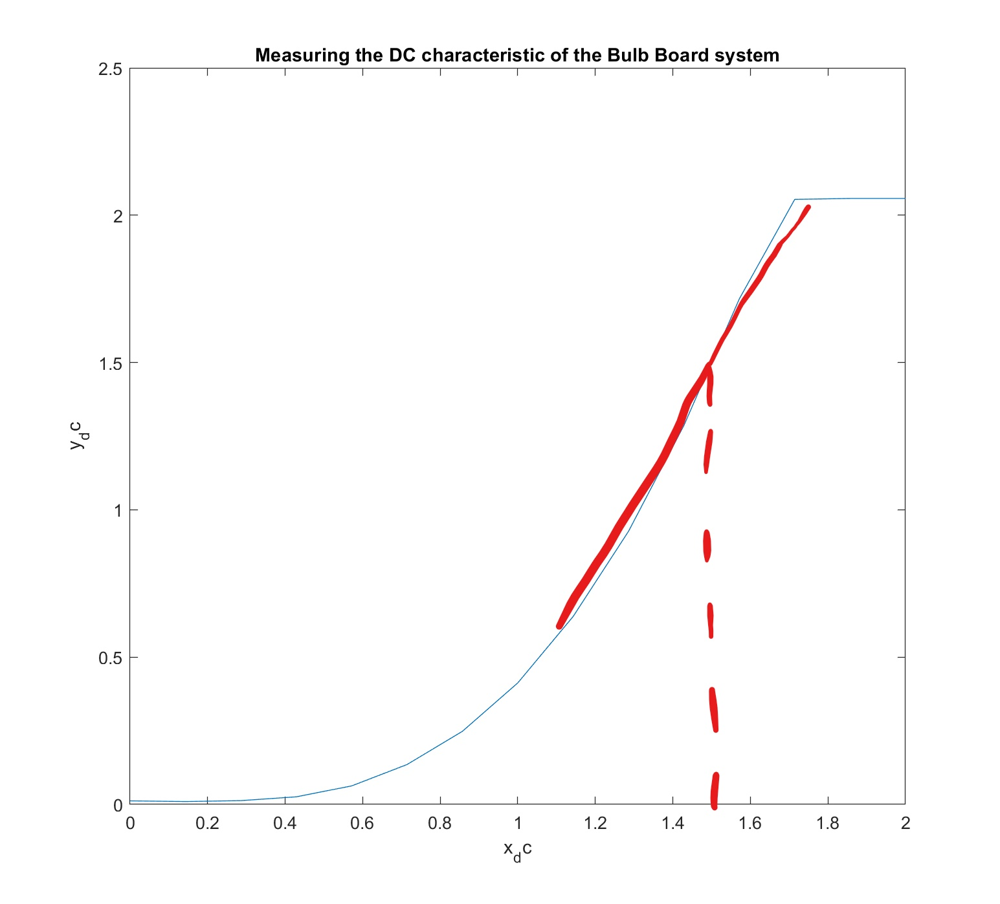
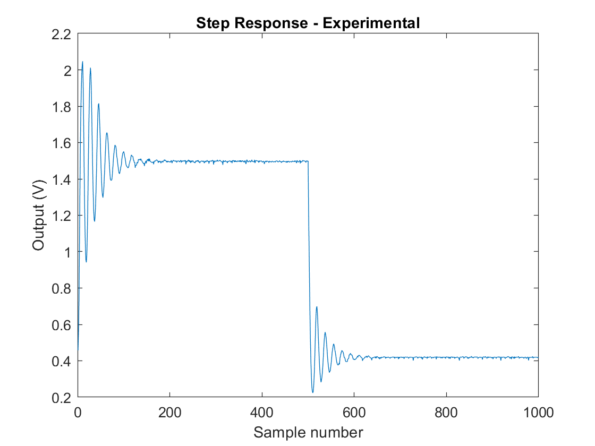
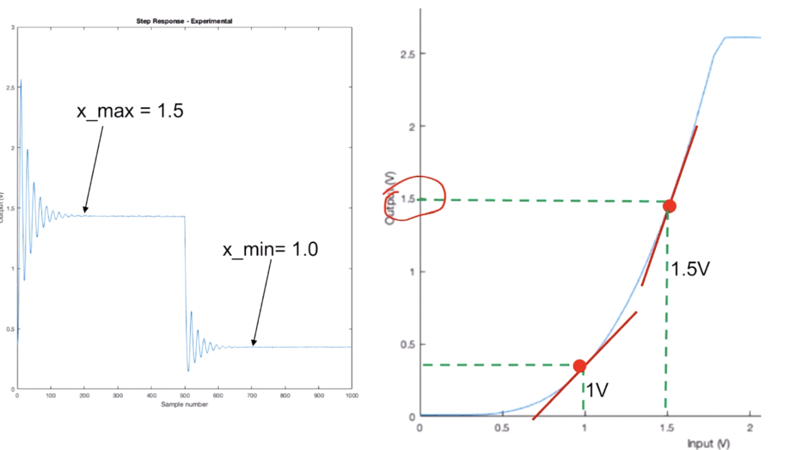

## Setup: Checking that the bulb board works

**Notes:** All went smoothly. <br />



## Exercise 1: DC Characteristic of the Bulb Board

1. Initial testing of using MATLAB with the Bulb Board. <br /> 

*Files:* No files. Methods were typed into the command line on MATLAB. <br />

This included using the ```pb.dc(voltage)``` method and the  ```pb.get_one()``` method. <br /> 

At first, the ```pb.get_one()``` method seemed to be returning all sorts of results. To control the test, the board was restarted and MATLAB was closed and reopened before each test of the method. This was repeated for ```pb.dc(0)``` and ```pb.dc(1.5)```. The results are shown below. <br />

| DC value (V) | Result 1 | Result 2 | Result 3 | Result 4 | Result 5 | Result 6 | Result 7 | Average |
|--------------|----------|----------|----------|----------|----------|----------|----------|---------|
| 1.5          | 24.2199  | 22.7721  | 22.7705  | 6.6645   | 25.0094  | 20.9199  | 20.5025  | 22.6990 |
| 0            | 3.3000   | 2.6812   | 3.5062   | 2.8875   | 3.0938   | 3.5062   | 3.3000   | 3.1821  |

<br /> 

 Note that before each measurement was made, I waited a few moments after setting the dc value. After a while, the ```pb.get_one()``` method was returning values close to 0 for both DC values (I think due to something within the circuit causing the photodetector to turn off). When this happened, the PyBoard and MATLAB were restarted. <br /> 

2. Finding the maximum and minimum voltage values for the bulb to light <br />

Filament starts to glow red at 0.3V = x_dcl <br />
Brightness doesn't increase any further after 1.7V = x_dch <br />

| x_dc | y_dc    |
|------|---------|
| 0.3  | 2.0456  |
| 1.7  | 48.6823 |

3. Writing a MATLAB file to find the ```a_in``` values for a range of inputted DC values. Then, a graph of x_dc can be plotted against y_dc to see the relationship. <br />

*Files:* lab3Task1.m, DC-characteristics-bulb-board.fig <br />

What we're putting in is a voltage, and we're getting light intensity out. <br />

The results show an initial linear section as the bulb heats up, followed by quadratic relationship (Determined by the formula P=V^2/R. In this case V is the inputted DC value and P is the light intensity) followed by a linear section when the bulb is fully heated. The final linear region is for x_dc values at 1.7V or higher - so my initial prediction for the max value for x_dc was correct! <br /> 



4. Optional task

(To be completed later) <br />

**Notes:** The ```pb.get_one()``` method measures ```a_in```. <br />

## Exercise 2: Frequency Response of the Bulb Board system - Simulation

*Files:* lab3Task2.m, theoretical-freq-response.fig,  <br />

We find and plot the theoretical frequency repsonse of the bulb board. <br />

**What is the frequency response?** The frequency response of a system is a plot of the Gain of the system verses the frequency of the signal. In other words, we plot G(jω) on the y-axis and ω or f on the x-axis.

 

To find the Gain, we need to know the transfer function of the system. The _Transfer Function_ is the ratio of the output of a system to the input of a system, in the Laplace domain, considering its initial conditions and equilibrium point to be zero.<br />

We can find the transfer function of a system if we know all the components in the system and its boundary conditions. In this case, we are given the 2nd order transfer function for our Bulb Board which is shown in the following image.

 

At the moment, this equation is dependent on _s_. To find the _frequency response_, we simply replace _s_ with _jω_. Using this equation means we are finding the _theoretical_ frequency response. In practice, the system will not perfectly behave according to this equation.

**The code:** 
1. Create an array of the frequencies, _f_, we want to plot.
2. Define _s_ as _jω_. In code this is written as ```1i*2*pi*f```. This creates an array of all the values of _s_ for the corresponding values of _f_.
3. The Gain of the system (in dB) is found by using the ```polyval()``` method and the equation for the Bulb Board shown above.
4. The result is plotted against _f_.

NB: The ```polyval()``` method evaluates a polynomial.

 

## Exercise 3: Measure the Frequency Response of the Bulb Board system using PyBench

1. Manually finding the frequency response at different sampling frequencies and plotting the results.

**Setting a range for the input voltage**: In Exercise One, you can see a flat line in the resulting plot for when the Bulb Board starts to behave like a linear system. Reading from the y-axis, this gives you a range for _x(t)_ (input voltage) for which the system approximately behaves linearly. This is the range we use in this task. This is important since we modelled the system as linear in the previous exercise and otherwise it would be far more complicated to analyse.

*Files:* lab3Task3.m, manually-finding-freq-response.fig <br />

| f_sig | G      | G_dB    |
|-------|--------|---------|
| 1.0   | 3.3354 | 10.4631 |
| 3.0   | 4.0847 | 12.2232 |
| 4.0   | 5.8250 | 15.3058 |
| 5.0   | 9.4343 | 19.4942 |
| 7.0   | 3.8188 | 11.6386 |
| 9.0   | 1.3213 | 2.42    |

 

**Comparing to the theoretical model:** Both the theoretical model and my measurements here agree that the maximum gain occurs at 5 Hz. Futhermore, in both cases the maximum gain is around 10 dB (give or take 0.5 dB).

2. A script was written to automate the process the done above. The two results were then compared.

*Files:* lab3Task3a.m, ex3a-freq-response.fig <br />

 

**Comparing manual and automatic measurements:** The highest gain occurs roughly at the same point in both results at 5Hz. However, the magnitude is higher on task 3a which is further from the theoretical prediction. Furthermore, the gain starts at a higher value for task 3a compared with 3. <br />

**Explanation of results:** The difference between our predictions for the gain and the measured values could be due to the following factors:
- **The non-linearity of our system plays a bigger part than we realised.**
From the graph produced in Task1 (DC characteristics of the Bulb Board), if you measure the gradient at 1.5V you get the gain of the system (called the _operating point_).
 
Other reasons include:
- Tolerances of the components in the system
- Inaccuracies of the measuring equipment
- Our model does not consider all the parasitics and unwanted effects that might exist in the real system.


## Exercise 4: Measure the Step Response of the Bulb Board

Here we analyse the transient behaviour of the Bulb Board by driving it with a step function. We drive the bulb with a rising step, then a falling step, between 1.0V and 1.5V, and capture the transient behaviour of the system. <br />

**Transient behaviour:** Steady state behavior is behavior that continues on indefinitely, if you keep the system state and its inputs the same. Steady state behavior is behavior that continues on indefinitely, if you keep the system state and its inputs the same.Transient behavior is any behavior that dies out over time. For example if you stepped up the input of your linear system to an amplitude of 2a at time t=0, you'd see the output jump in amplitude from 4a to 8a, but it would take some time to do that. The behavior during that transition, from when it's behaving like it had a a input for a long time to when it settles down to behave like it had a 2a input for a long time, is the transient behavior. <br />

The appearance of transient behaviour depends on the circuit and the stimulus that produced it. Transient behavior gives a more complete picture of the circuit behavior that also includes the possibility of inputs changing over time. As a designer, you have to deal with it accoridngly or design your circuit to produce the behavior you need.<br />

**Transient response of the Bulb Board:** The graph below shows how our Bulb Board displays an _underdamped response_. This means that it oscilates for a while before reaching a steady-state. This aligns with the frequency response graph which had a peak - a characteristic of an underdamped system - rather than decreasing from a starting value with no peak.

 

**Why one oscillation is bigger than the other:** the oscillation amplitude of the rising step is significantly bigger than that of the falling step. When we go up to 1.5 (on the rising step) we operate over the region with a certain gain (big graident). When we go down to 1v, we operate in a different part with a very different gradient (much smaller). That accounts for the differnece in the oscillation amplitude.

 
