## Exercise 1:  The Inertia Measurement Unit (IMU)

1. Testing the accelerometer.

*Files:*  lab4task1a.m, lab4task1b.m <br />

Plot produced whilst the board was moving: 
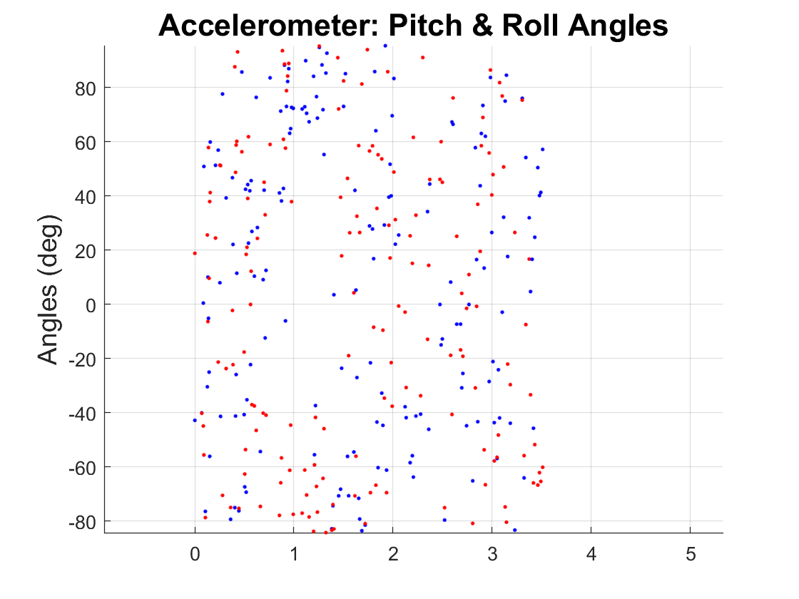 
<br />

Plot produced whilst the board was horizontal facing down: 
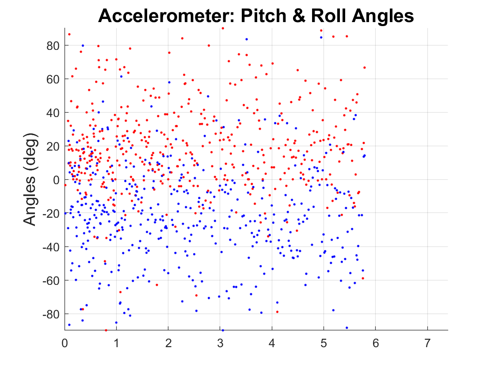 
<br />

As you can see from these graphs, there is a lot of noise produced. So much so that is difficult to tell them apart and, therefore,  be able to tell when the PyBench is moving or not. <br />

However, a friend told me she had the same problem and that simply closing and reoping MATLAB solved it. This is because sometimes communication between the PyBench and MATLAB can get out of sync. You can see in the following images that moving left and right changes the red plot, meanwhile, moving forward and backward affects the blue plot. <br />

Moving left and right:
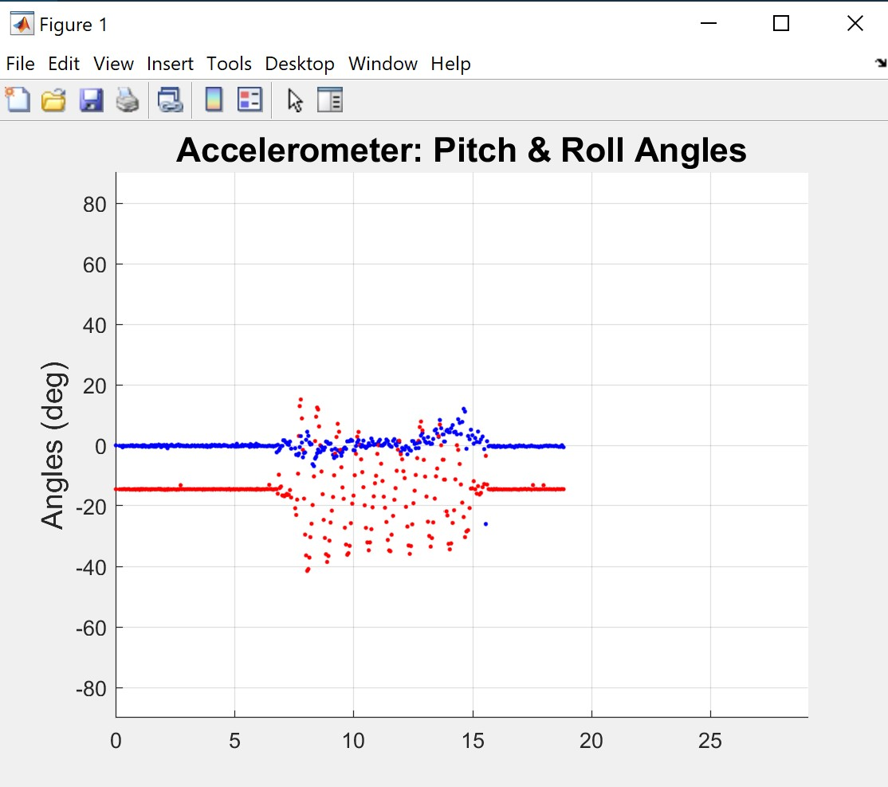 <br />

Moving forward and backward:
 <br />

There are two tiny arrows on the accelerometer which tell you whether you are moving in the postive direction for x or y. 

2. Testing the gyroscope

This was successful. The two graphs below show the results. The quicker you roll, the messier the graph looks due to the time lag. The higher peaks correspond to a greater amount (angle) of rolling. <br />

Rolling left and right:
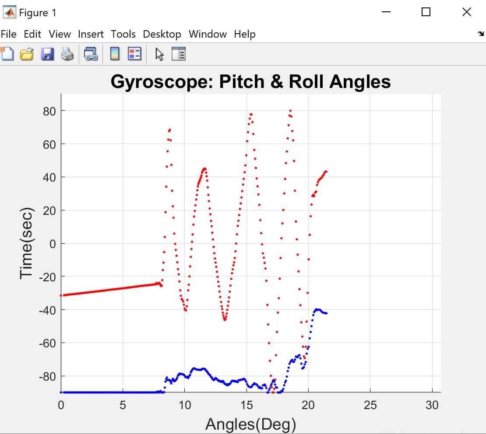 <br />

Rolling forward and backward:
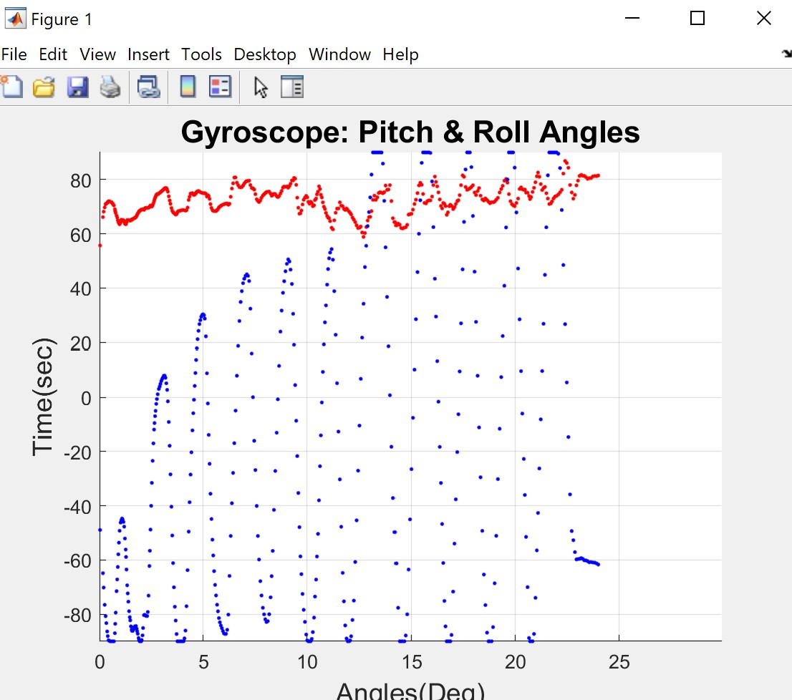 <br />

Rolling too quickly:
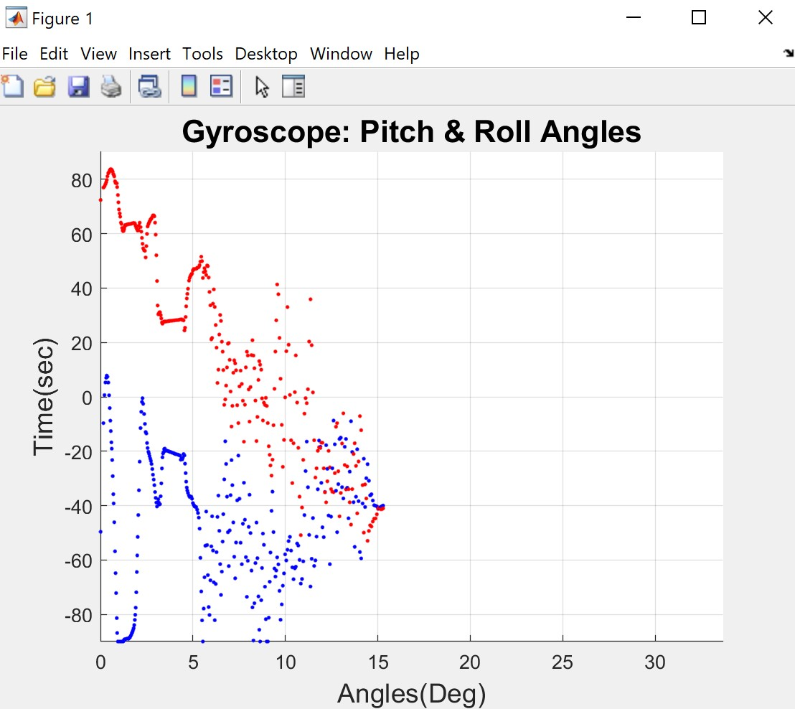 <br />

## Exercise 2:  Visualization in 3D

*Files:*  lab4task2.m <br />

This exercise plots a live 3D model of the board. At first, the plots below show how we were unsure whether they were correct. There seemed to be no pattern in results.

Flat face down:
 <br />

Flat face up:
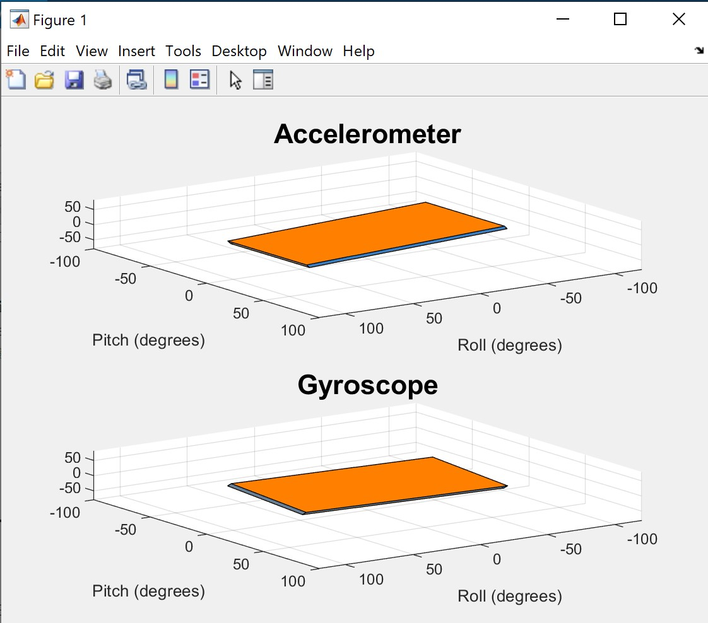 <br />

Vertical (either side)
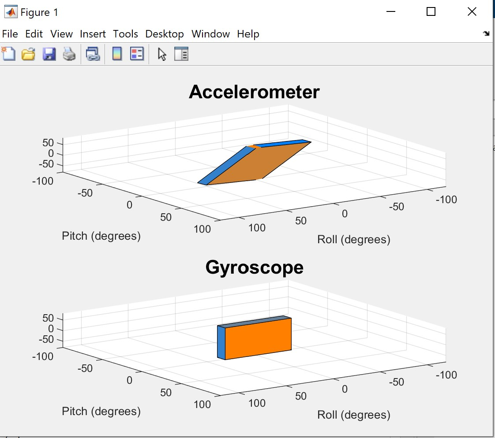 <br />


The gyroscope gives us the rate of change in angles of the board and we need to derive the angle of the board from this. This is done by multiplying the rate of change of angle by the time incremenent since the last reading. ```gy``` is the pitch angle, ```gx``` is the roll angle. <br />

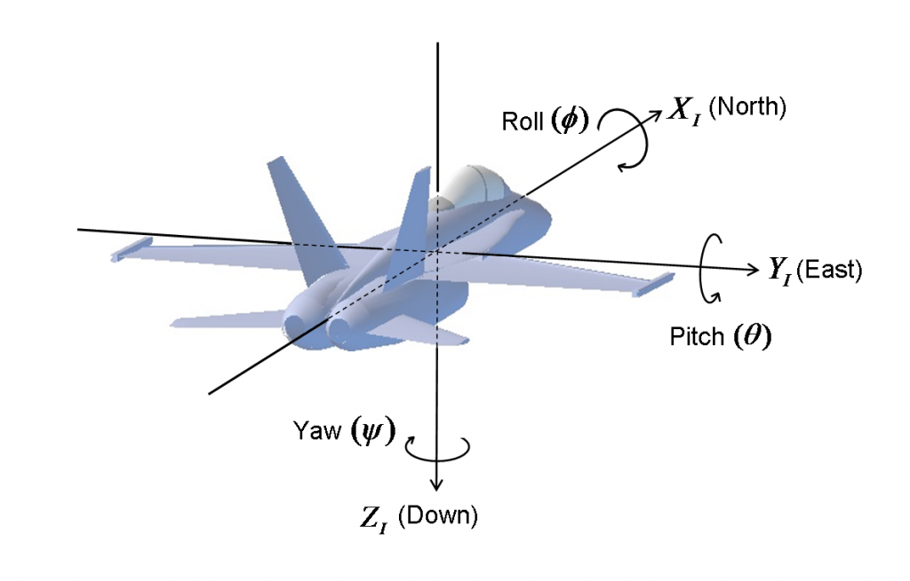 <br />

At the start of the code, the gyro angles are set to 0. As the program is run, ```gy``` and ```gx``` accumulate (note they are limited to +-pi/2) which also means that errors accumulate. The error we see is due to this accumulation in error. Unless ```x``` is 0, the error in ```gy``` and ```gx``` increases each time the position of the PyBench changes which means that with time the gyroscope reading drifts from the origin. This drift is a DC offset. <br />

On the other hand, whilst the accelerometer does not drift with time, each reading in itself is noisy and usually more noisy than the gyro. The accelerometer measures the forces on the PyBench in the x and y directions. The noisiness it shows occurs when it is motion as the motion introduces additional forces on the PyBench other than those due to gravity.


## Exercise 3: Combining the two measurements using Complementary Filter

*Files:*  lab4task3.m <br />

The results from exercise 2 were improved by introducing two filters. <br />

**Accelerometer filter:** We use a _low pass_ filter to reduce noisiness on the accelerometer readings (suppresses high frequency noise). The goal of this is to only let through long-term changes and filter out short-term fluctuations. <br />

**Gyroscope filter:** We use a _high pass_ filter to remove the DC offset (drift) form the gryo readings. <br />

**Complementary filter:** Both of these filters together in one system is called a _complementary_ filter. <br />

**Filter coefficients:** In our code our filter coefficient is labelled _alpha_. This is calculated from the _time constant_ which is the relative duration of signal it will act on as well as the _sample rate_. For a low pass filter, signals much longer than the time constant pass through unaltered while signals shorter are filtered out. For a high pass filter, the opposite is true. <br />

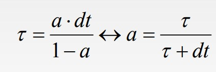 <br />

For example:

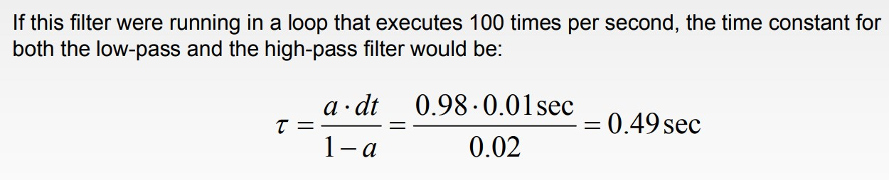 <br />

Putting it all together to filter our angles:
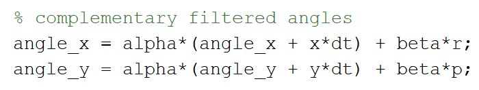 <br />
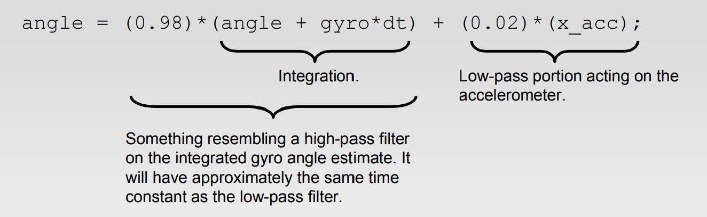 <br />

**In summary:** This means that a lower value for alpha reduces the amount of time it takes for the model to settle in the correct position, but it increases noise in the accelerometer readings, so it is a trade off. 

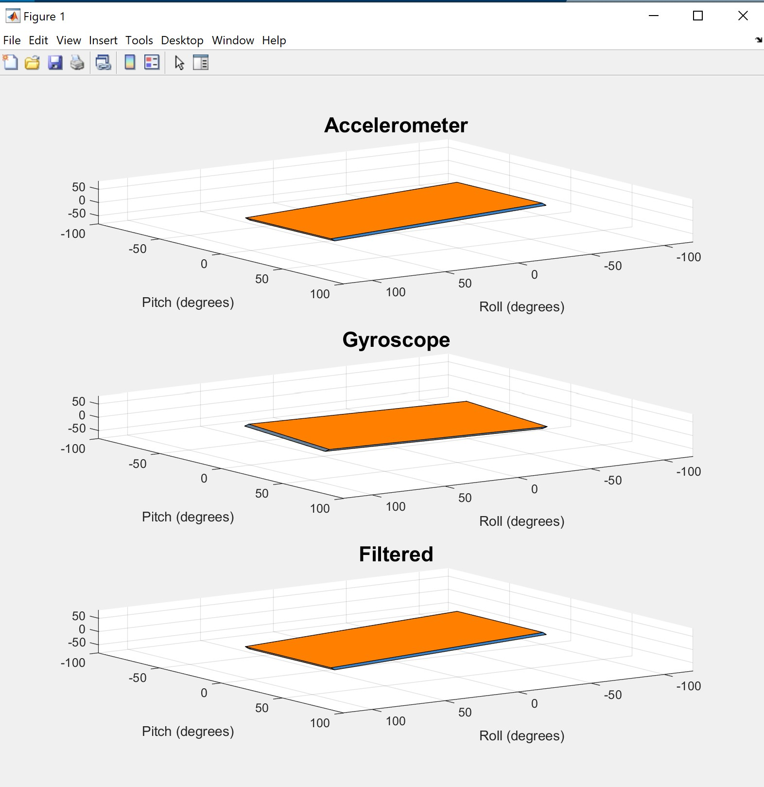 <br />

**Experimeting with different values for alpha:** COME BACK TO THIS

## Exercise 4: Using the OLED driver on the PyBench Board

*Files:* lab4task4.py, user.py <br />

This time, we communicate with the PyBench directly using PuTTY rather than MATLAB.<br />

To check the board and computer were communicating, the blue LED was toggled. It turned on and offaccordingly. However, the oled display struggled with ```oled.init_display()``` and ```oled.display()``` and these errors continued when either the _user.py_ or _lab4task4.py_ files were run (to run these files, they were first moved onto the SD card of the PyBench and then they could be called via the terminal).

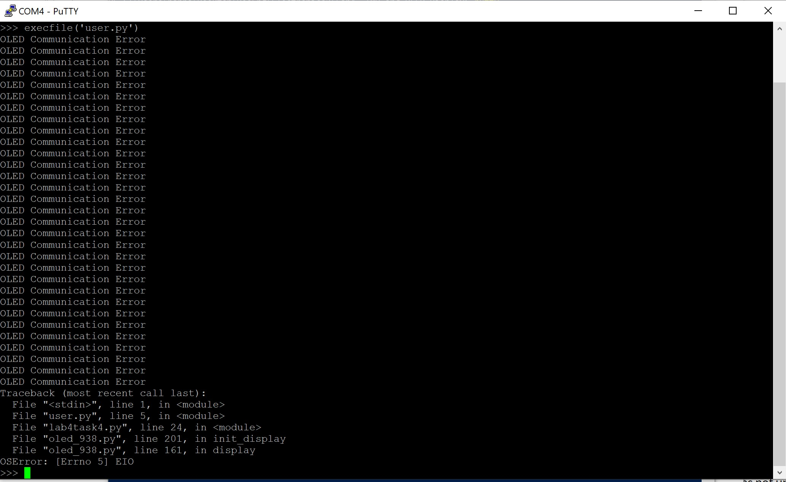 <br />

In the end, the ```i2c_devid``` number from line 22 in lab4task4.py neeed to be changed. i2c is a serial protocol, on 1 wire coming out of the CPU you can connect more than 1 i2c device, each one has an address, so the first part of the serial message sent on the wire might address = 1 and the i2c device with address will listen for the rest of the message. Devices come pre-programmed with an address, sometimes the device has a pin or 2 to select which address it should use (out of a choice). If you look up the chip used in the display it should tell you

Changing the ```i2c_devid``` number gave the desired result.

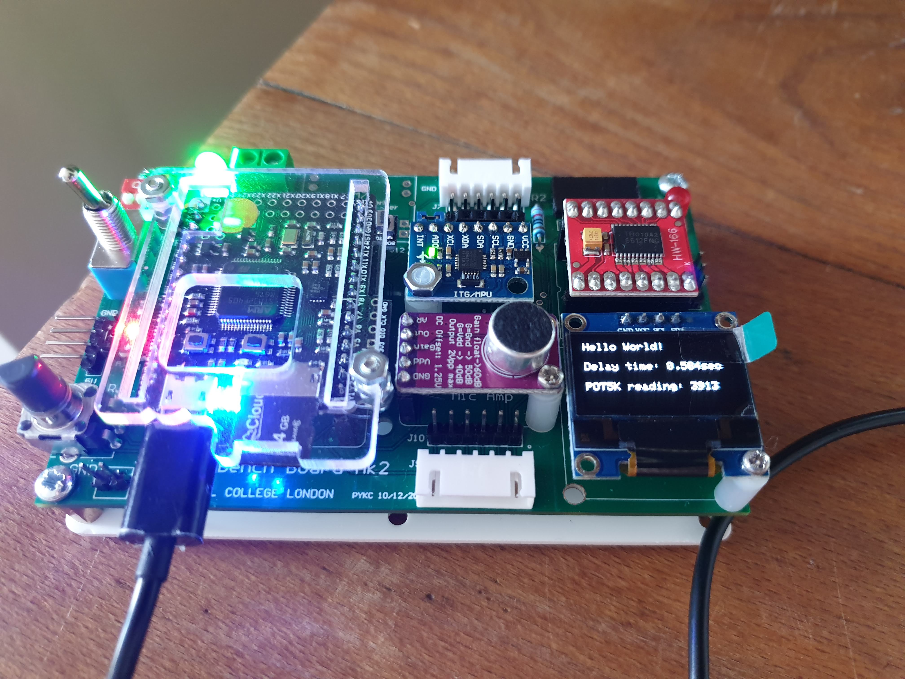 <br />

**Additional task:** COME BACK TO THIS

## Exercise 5: Using the IMU driver on PyBench Board

Again, after changing the i2c number, this all worked well.

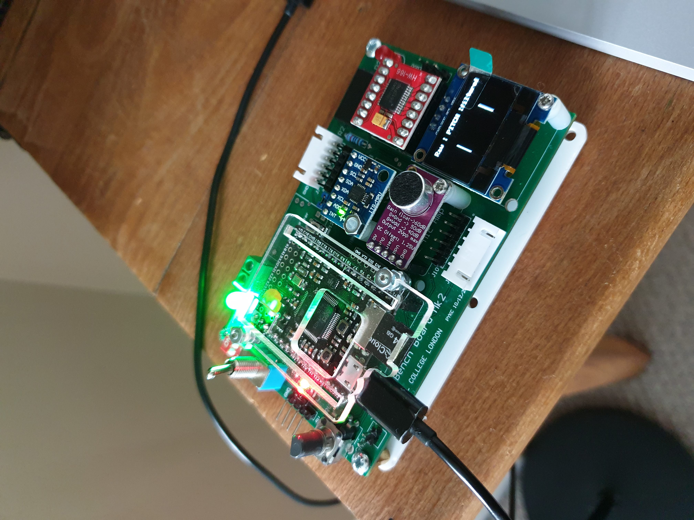 
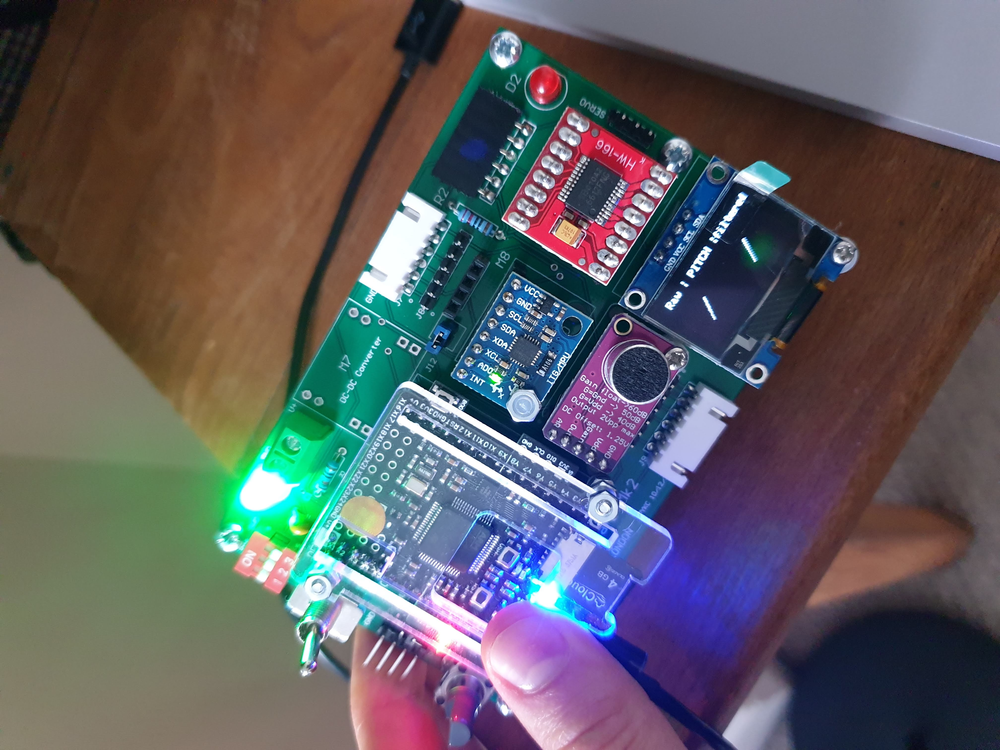
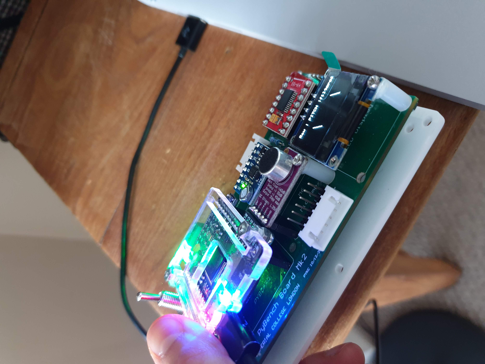 <br />
