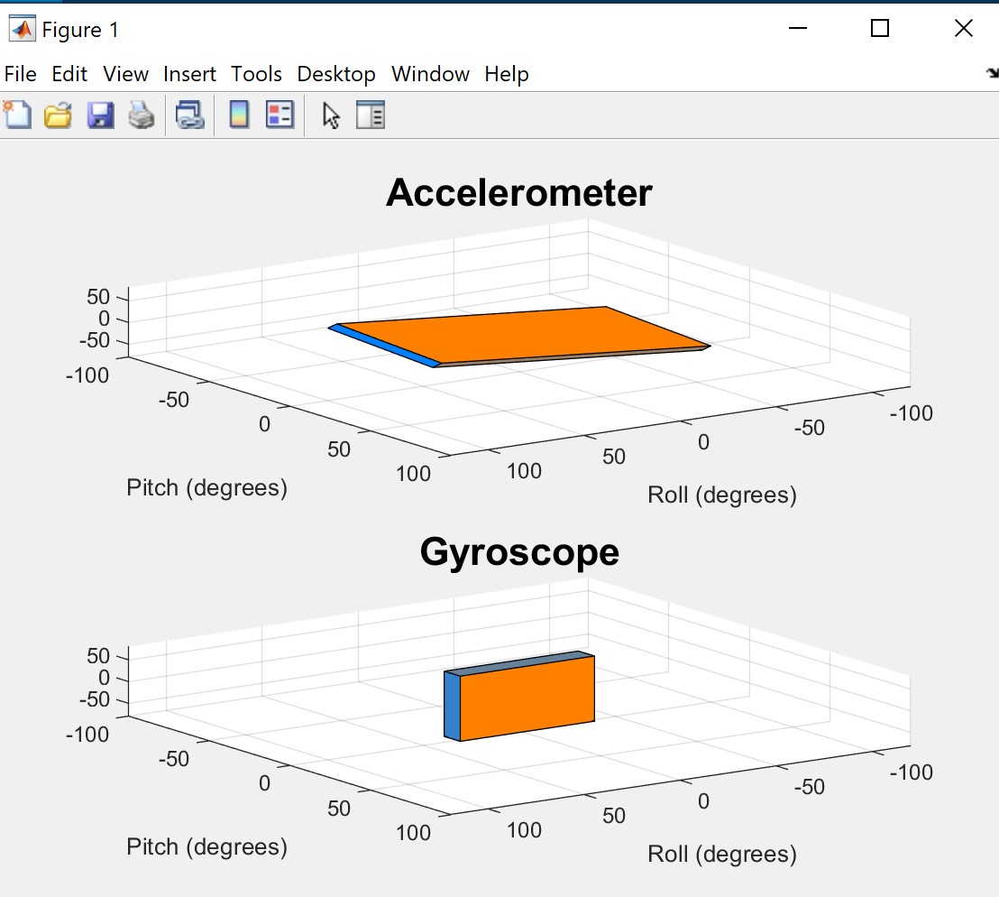

## Exercise 1:  The Inertia Measurement Unit (IMU)

1. Testing the accelerometer.

*Files:*  lab4task1a.m, lab4task1b.m <br />

Plot produced whilst the board was moving: 
 
<br />

Plot produced whilst the board was horizontal facing down: 
 
<br />

As you can see from these graphs, there is a lot of noise produced. So much so that is difficult to tell them apart and, therefore,  be able to tell when the PyBench is moving or not. <br />

However, a friend told me she had the same problem and that simply closing and reoping MATLAB solved it. This is because sometimes communication between the PyBench and MATLAB can get out of sync. You can see in the following images that moving left and right changes the red plot, meanwhile, moving forward and backward affects the blue plot. <br />

Moving left and right:
 <br />

Moving forward and backward:
 <br />

There are two tiny arrows on the accelerometer which tell you whether you are moving in the postive direction for x or y. 

2. Testing the gyroscope

This was successful. The two graphs below show the results. The quicker you roll, the messier the graph looks due to the time lag. The higher peaks correspond to a greater amount (angle) of rolling. <br />

Rolling left and right:
 <br />

Rolling forward and backward:
 <br />

Rolling too quickly:
 <br />

## Exercise 2:  Visualization in 3D

*Files:*  lab4task2.m <br />

This exercise plots a live 3D model of the board. At first, the plots below show how we were unsure whether they were correct. There seemed to be no pattern for when

Flat face down:
 <br />

Flat face up:
 <br />

Vertical (either side)
 <br />

This error is due to the ```gx``` term in the code. Unless ```x``` is 0, gx increases


## Exercise 3: Combining the two measurements using Complementary Filter

The results from exercise 2 were improved by introducing a filter.

Note that a lower value for alpha reduces the amount of time it takes for the model to settle in the correct position, but it reduces the accuracy in the gyroscope, so it is a trade off. 

 <br />