## Setup

The wires for the battery pack needed to be connected by unscrewing the green thing shown below.


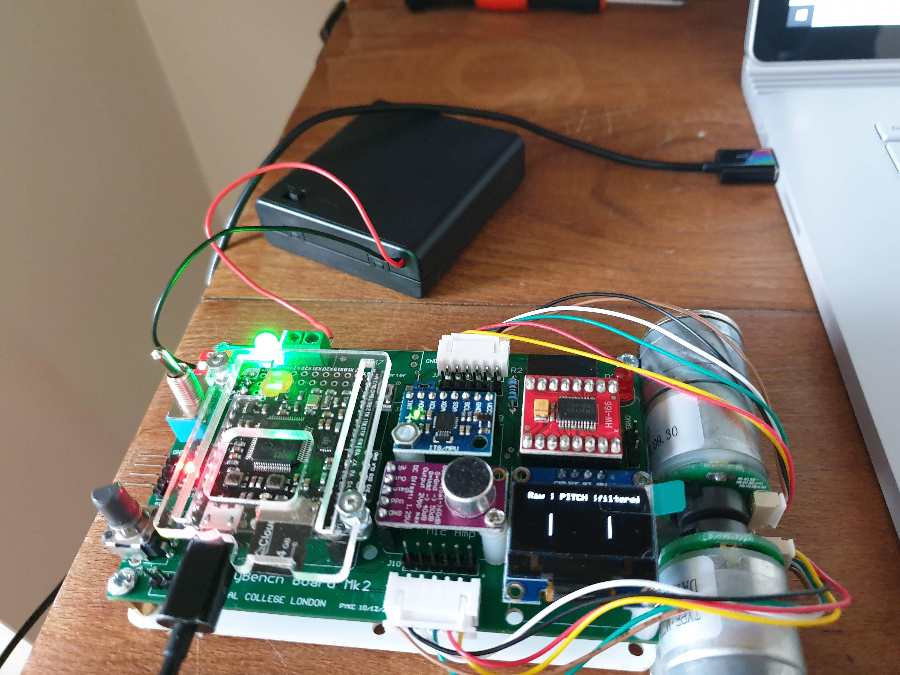
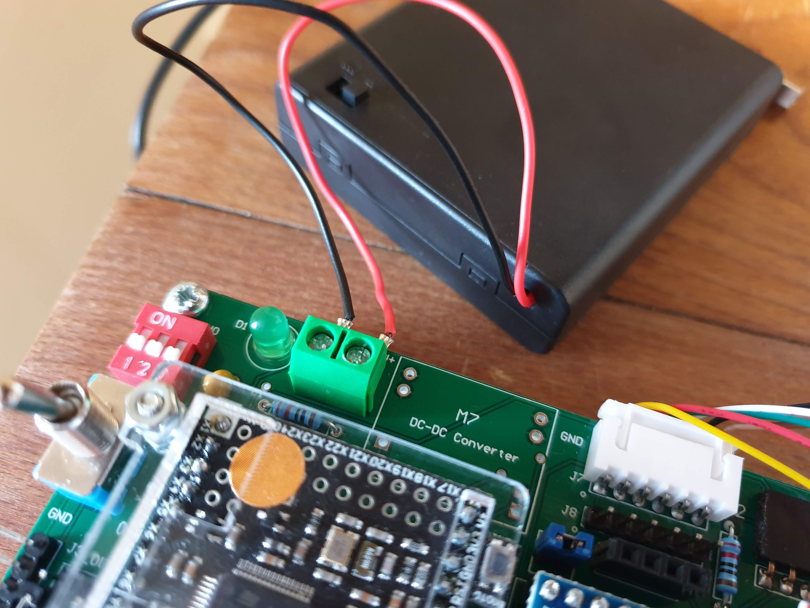 

## Exercise 1: DC Motor and H-bridge

*Files:* lab5task1a.py, lab5task1b.py, lab5task1c.py <br />

The motors were connected and a python script was used to turn them. _lab5task1a.py_ is a script that can be used to determine which motor is motor A as it only turns on this motor. <br />

_lab5task1b.py_ uses the potentiometer to change the speed of the motor. PuTTY was used to connect to the PyBench and read the value of the potentiometer using the following lines of code. ```value``` gives a number from 0 to 4095 which is the range you get from 12 bits (ie 2^12).

```
pot = pyb.ADC(Pin(‘X11’))
value = pot.read()
```

Changing the speed did not happen instantaneously. The PyBench had to be reset for the motors speed to be visably changed and this was confirmed by also restarted PuTTY and re-reading the potentiometer value.

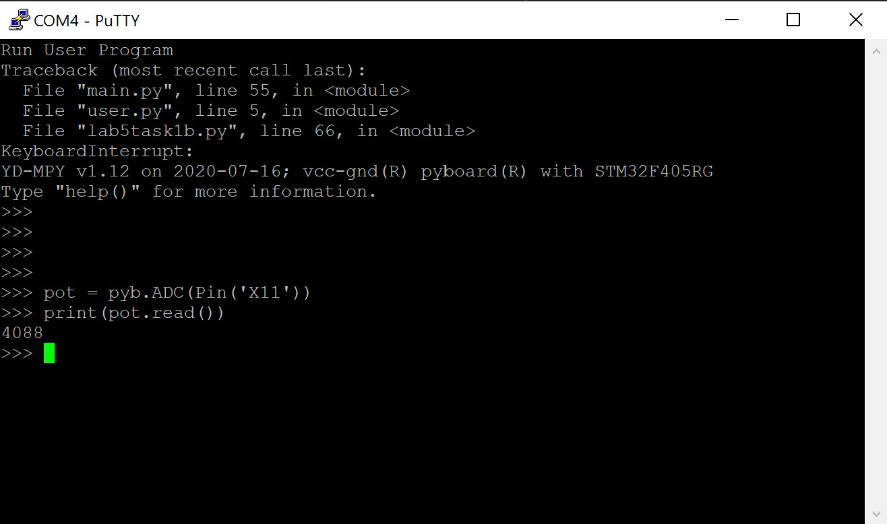 

_lab5task1c.py_ displays the PWM duty cycle on the OLED display. This read a negative value when turning one way. It only got to a maximum motor drive of 99% in one direction and -99% in the other. The motors stopped turning at around 4%. Slightly above or below (12%) the motors would make a very high pitched noise without turning. <br />

_lab5task1c.py_ was edited to read the potentiometer value (0-4095) and display this underneath the motor drive on the OLED display. <br />

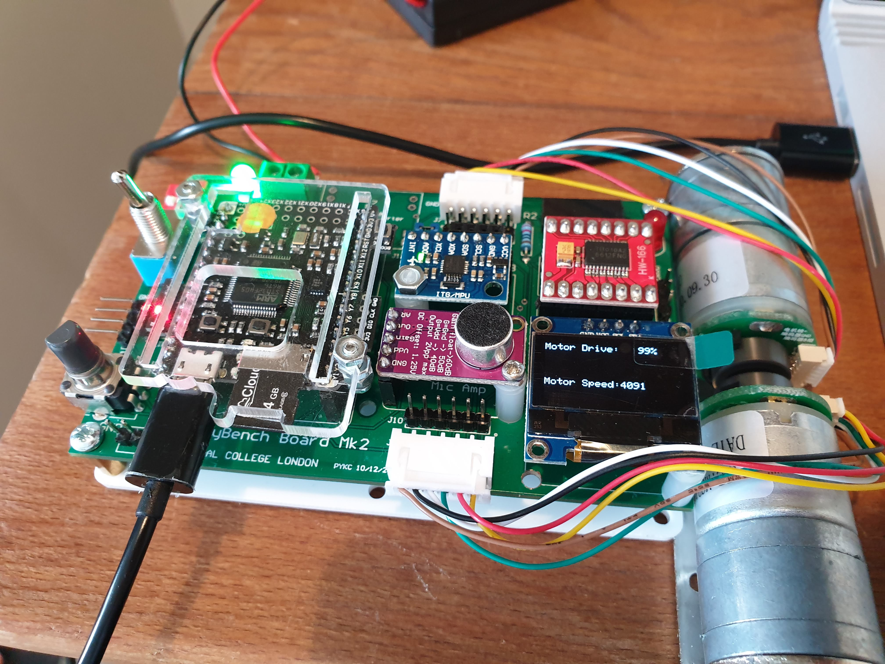 
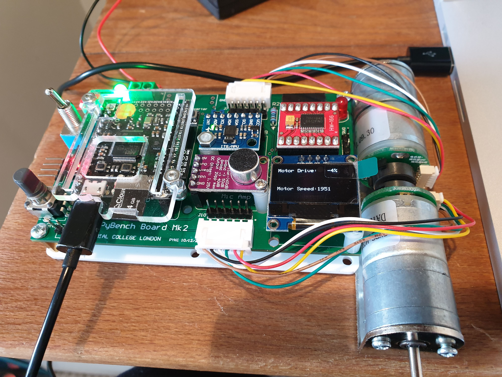 
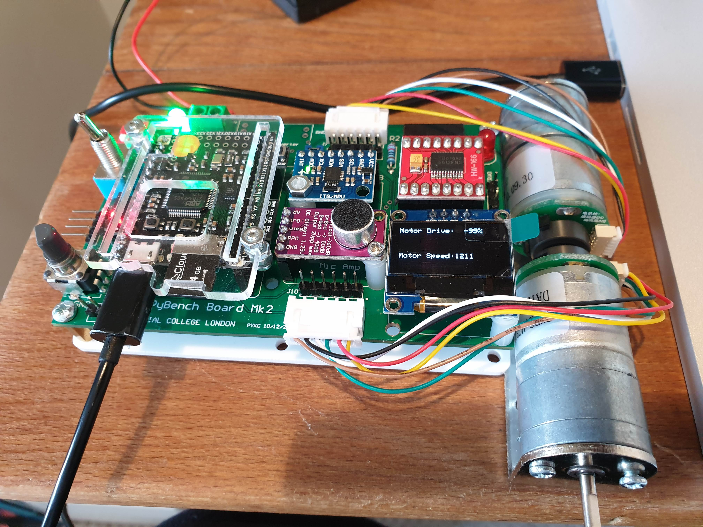 

**General notes:**
- When connected to my laptop with the battery pack switched off, they turned. When the battery pack was switched on, they turned faster. When the PyBench was disconnected from my laptop with the battery pack still switched on, the continued spinning at the higher speed.
- There are two motors which are labelled A and B in the Python files.
- ```Pin.high()``` sets pin to “1” output level and ```Pin.low()``` sets pin to “0” output level. 
- We use an on-chip timer circuit inside the microcontroller to generate a 1000Hz PWM signal to drive the motor.
- 

**Notes on the timer circuit:**
- Each motor has two pins which are used to control the direction the motor turns. Each timer consists of a counter that counts up at a certain rate. The rate at which it counts is the peripheral clock frequency (in Hz) divided by the timer prescaler. When the counter reaches the timer period it triggers an event, and the counter resets back to zero. By using the callback method, the timer event can call a Python function. For more information on pyb Timers please see: https://docs.micropython.org/en/latest/library/pyb.Timer.html 
-  All timer channels share the same underlying timer, which means that they share the same timer clock. For more information on the pyb channel timer methods please see: https://docs.micropython.org/en/latest/library/pyb.Timer.html?highlight=tim%20channel#pyb.Timer.channel


Video of motor turning on:
 <br />

## Exercise 2: Detect the speed of the motor

*Files:* lab5task2a.py, lab5task2b.py <br />

1. Graphing the outputs on pins Y4 and Y5 <br />

Using the oscilliscope, the signal from pins Y4 and Y5 on the PyBench could be found. This was a square wave showing the PWM nature of the signal. Changing the speed changed the width of the wave. Slower speeds led to narrower widths of peaks and faster speeds led to broader widths of peaks.<br />

Fastest speed:
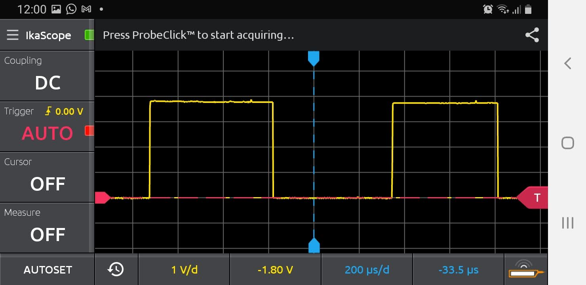 

Slower speed:
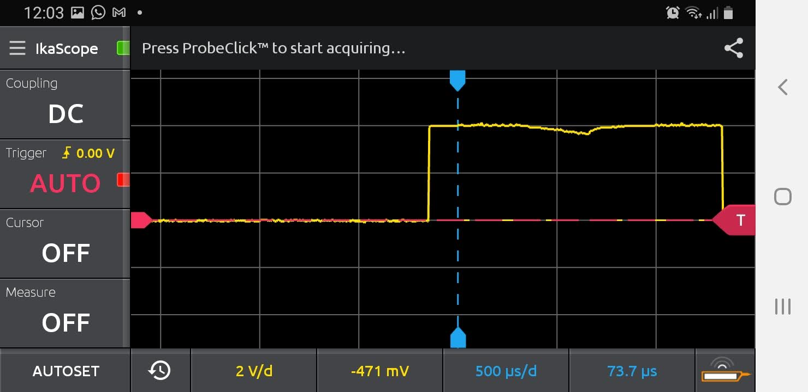 

Motors off:
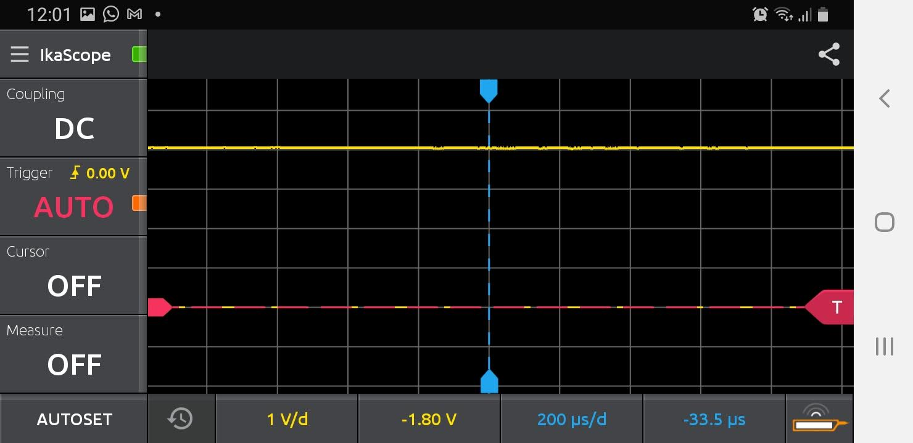 

NB: You can detect the speed of the motor by counting the number of positive transitions (low-to-high) on Y4
or Y5 in a time period of 100 msec, and divide the count value by 39 to obtain the number of revolutions
of the wheel per second (rps). <br />

2. Detect the speed of the motor by polling.<br />

_lab5task2a.py_ finds the internal real-time clock in millisecond to keep tic and toc variables. By doing so, elapsed time can be calculated as toc - tic. Furthermore, it is very quick to settle on the final speed.

| Min speed (rps) | Max speed (rps) |
|-----------------|-----------------|
| 0.00            | 3.03            |

Why is the reported speed very noisy? <br />

_lab5task2a.py_ was edited by adding ```pyb.delay(1)``` after the while loop. However, this made the reading completely incorrect as it read a minimum rps reading when the motors were clearly turning full speed and a maximum somewhere in between the min and max speeds. <br />

_lab5task2b.py_ displayed the speeds of both motors on the display. Rarely were they the same. Motor A seemed to consistently be a higher speed.<br />

**Explanation:** The while loop is continuously looking for a low-to-high transition on motor A sensor signal on pin Y4. Within the loop, you also continuously check to see if 100msec has elapsed. If yes, you save the transition count (in A_speed) and reset the counter. The continual checking program loop is known as “polling”. It is analogous to owning a telephone that has NO ringer. To see if anyone is calling, you need to “poll” the phone by picking it up and check to see if someone is one the line! This is a simple way to check, but it is extremely inefficient.

## Exercise 3: Speed measurement using interrupt 

The code for this exercise was edited to make _lab5task3.py_ which displays the accurate speed measurement (using interrupts) for _both_ motors using the OLED screen.

| Min speed (rps) | Max speed (rps) |
|-----------------|-----------------|
| 0.00            | 3.18            |

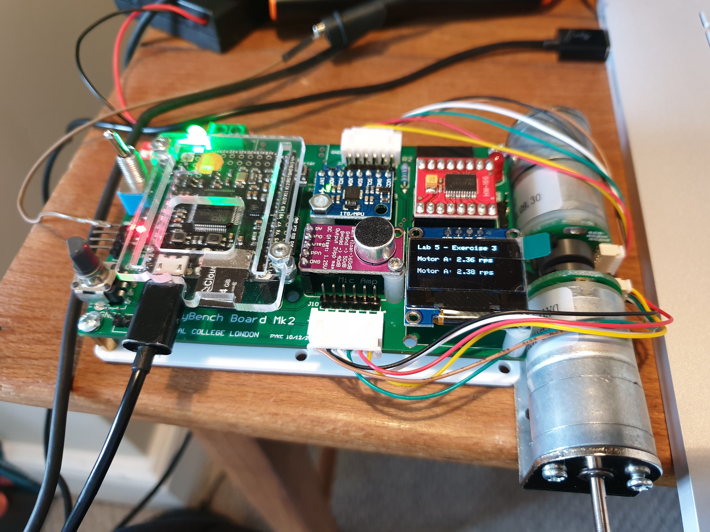 
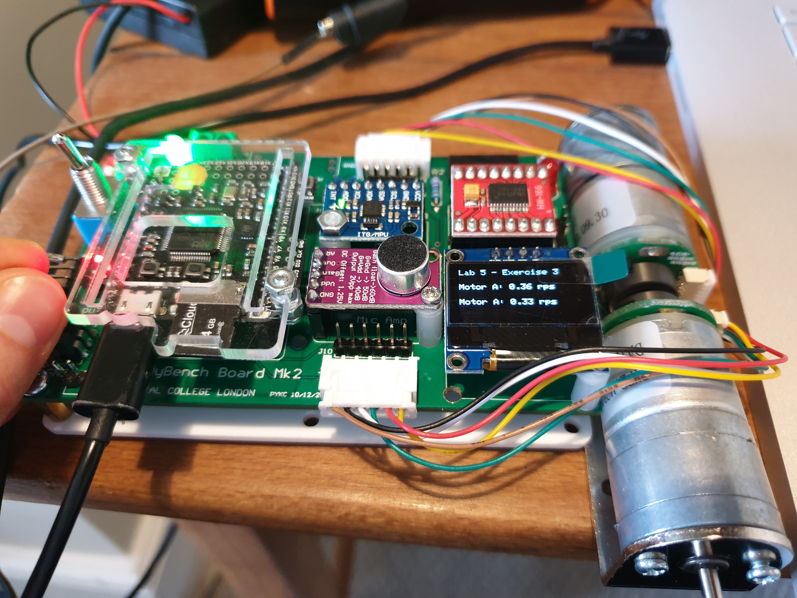 
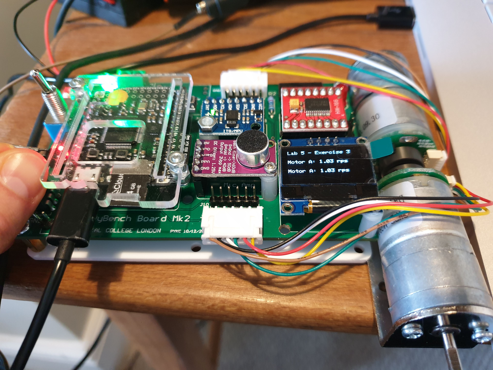 