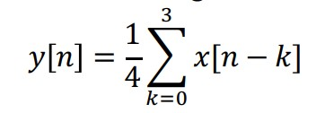
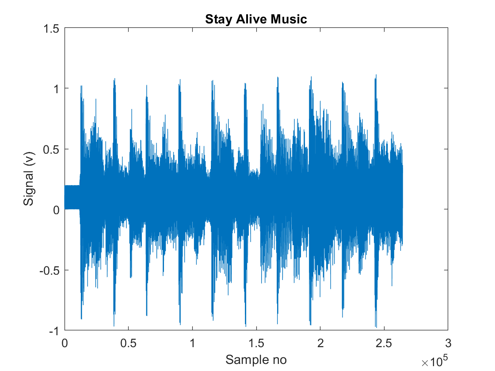
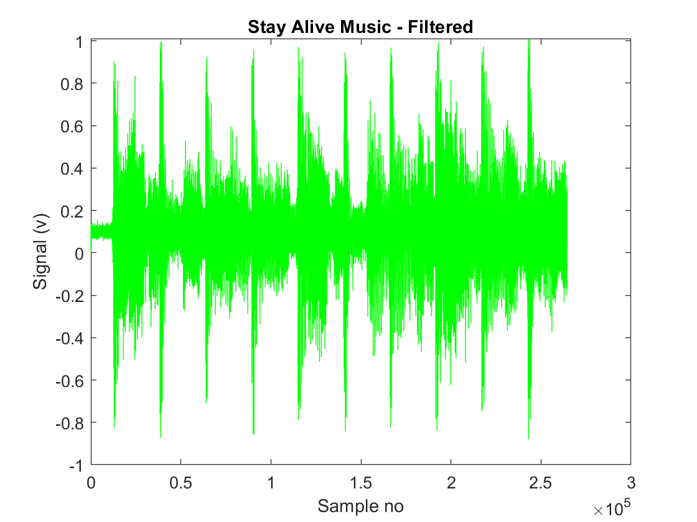
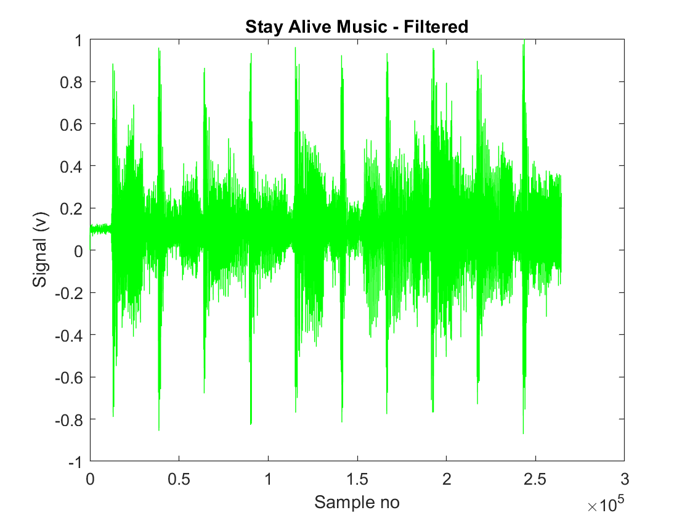
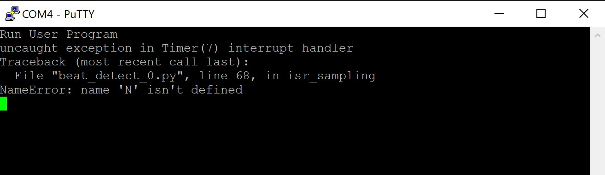

##  Exercise 1: Moving Average filter

*Files:* lab6task1a.m, lab6task1b.m <br />

**What:** The MATLAB file _lab6task1a.m_ adds noise to a music sample, then uses a moving average filter to attempt to remove that noise. <br />

**Results:** When playing back the music sample for which the moving average filter had been applied, noise clearly still existed in the file, however, the amount of noise had been reduced. <br />

**Moving average filter:** Takes N number of samples of input at point in time and takes the average of those to make one output. For example, the formula for the ouput of a 4-point moving average filter would look like the following: <br />



Since averaging reduces the effect of fast changes, this is essentially a lowpass filter. <br />

**Change the variable for the number of taps:** The MATLAB file _lab6task1b.m_ was run multiple times, each time increasing the number of taps by 5. The number of taps was tested in the range 5-50 plus an additional measurement at N = 100. <br />

Increasing the number of taps certainly reduced the amount of noise that remained in the music file sample, however, it also meant that the volume of the music file was reduced, too. <br />

The biggest drop in noise was noticed when the number of taps was increased from 15 to 20. <br />

Whilst the amount of noise had reduced for N = 100, it had not all disappeared. Furthermore, the main music sample was even quieter. <br />

However, it is worth noting that it is difficult to measure how much noise remains solely by listening. This experiment would be more accurate if there was a more accurate method of measuring the signal-to-noise ratio. <br />

The following MATLAB figures show how the amount of noise decreases from N = 20 to N = 50 but that even when N = 50, the signal still does not look like the original signal.

Original signal:



N = 20:



N = 50:



##  Exercise 2: Basic beat detection

*Files:* beat_detect_0.py, buffer.py <br />

**What:** The goal is to run real-time code using PyBench that detects when a beat occurs. In this exercise, we are given a Python script that lights a blue LED when a beat is detected. From understanding this, we can improve this script for our assessed challenge. <br />

**Results:** When the *beat_detect_0.py* file was first run on the PyBench, the blue LED did not flash once, no matter how loud the music was. <br />

In the file, there is a variable called ```MIC OFFSET``` that is the ADC reading of microphone for silence. I thought that this may be the wrong value, as it is different for every PyBench, so PuTTY was used to find what it is for my board by running the following: <br />

```
from pyb import Pin, ADC
mic = ADC(Pin('Y11'))
mic.read()

```
The value was 1522, only 1 less than what was already in the script, therefore, this is not the issue. <br />

Using PuTTY, the following error were found.



I ran the PyBench self-test and realised that the short-circuit jumper was not installed meaning it could not produce a sine wave. Since the ADC/DAC is needed for this script, this needs to be installed, so I reran the file with this in place. <br />

The PyBench had to be restarted a few times until the blue LED flashed. Then, it flashed, but not to the beat of the music. The ```MIC_OFFSET``` was changed from the original value of 1522 to 1650 to see which one was the most accurate. **It was found that a MIC_OFFEST value in the range of 1600-1630 are the most accurate for making the blue LED flash in time with the musical beats.** <br />

Other things to note:
- Playing the music from my phone and holding it close to the PyBench was more succesful than using my laptop.
- As the layers in the music get more complex, PyBench struggles more to detect where the main beats are.
- PyBench only seems to detect clear, distinct beats that have a second between them. When beats are played too quickly, it does not pick them all up.

## Improving the beat_detect_0.py file

Suggestions for how this file can be improved:
- Apply a moving average filter before calculating energy to remove noise.
- Make the code specific to the song you want to detect beats for. Check the song's energy spectrum and find the ratio c = instantenous energy/(sum_energy/50) for the beat you are detecting.
