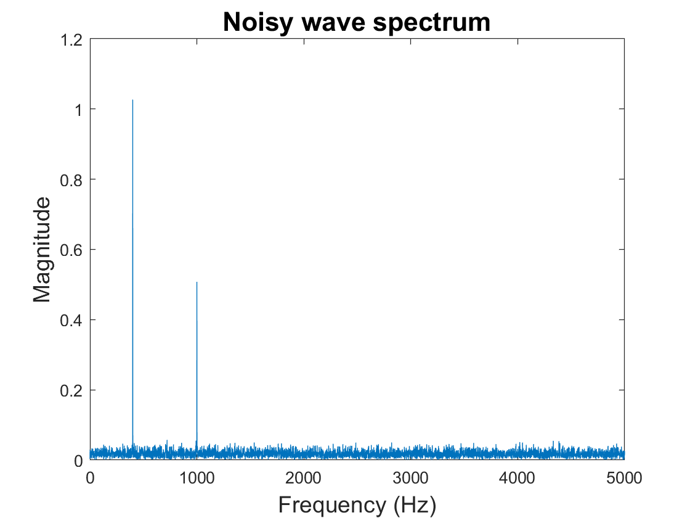
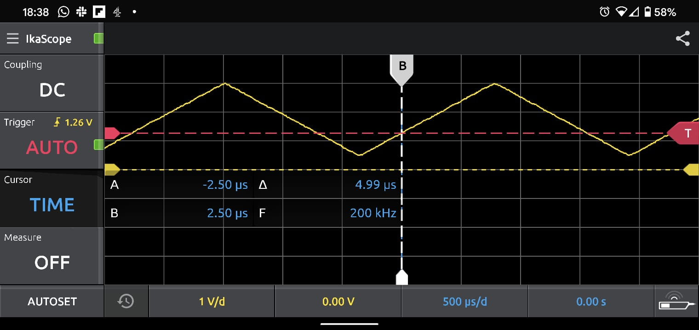
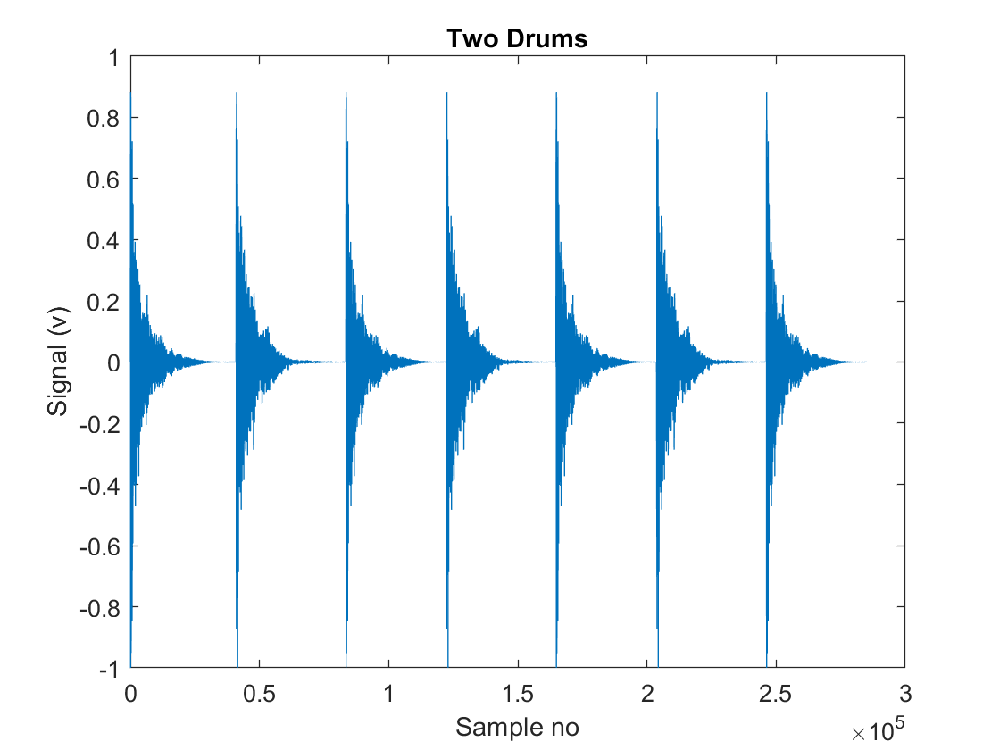
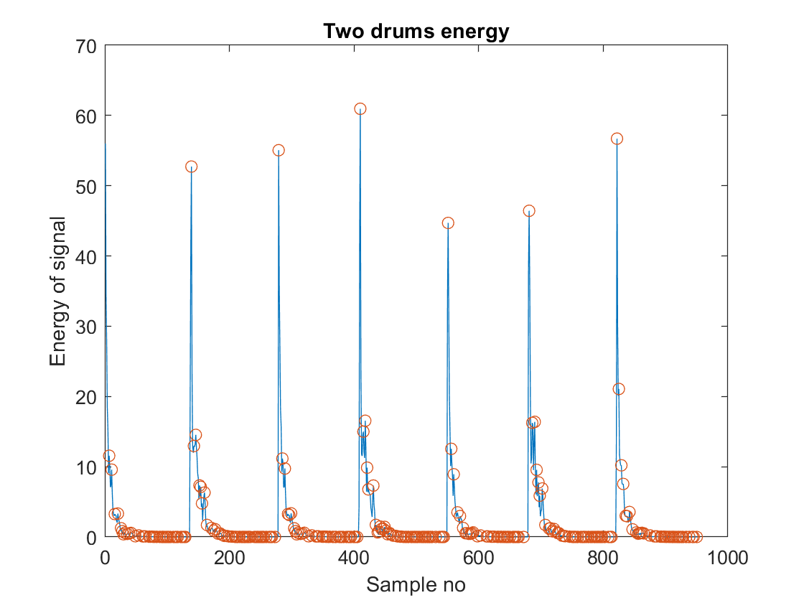

# Electronics2

All my work associated with the Electronics 2 module, year 2, Design Engineering, Imperial College London, 2021.


## Lab1 - Introduction to MATLAB

Link to notes: https://github.com/hannahjayneknight/Electronics2/blob/main/Lab1-IntroToMATLAB/notes-lab1.md <br />

Tasks:
1. Function that generates a sine signal.
2. Function that plots a frequency spectrum.
3. Comining two sine waves of different frequencies and amplitudes and plotting the resulting waveform and frequency spectrum.
4. As above (exercise 3) but with noise added.
5. **Projecting** signals onto one another using the dot product. <br />

 <nobr>

 <nobr>

 <nobr>


## Lab2 - Signal Processing with PyBench & Matlab

Link to notes: https://github.com/hannahjayneknight/Electronics2/blob/main/Lab2-SignalProcessing/notes-lab2.md <br />

Tasks:
1. Check that Matlab on your computer is talking to PyBench hardware
2. Using PyBench to generate sine, square and triangular signals via Matlab.
3. Capture and plot signals from whistling. See the effect of changing the **sampling frequency** or **number of samples** collected. Used a while loop to continously plot the signal.
4. Plotting the microphone signal on a **logarithmic (dB) scale** and using a **Hamming window** to remove noise.
5. Plotting a music file consiting of drum beats. The peak amplitude of each beat was found.

 <nobr>
 
 <nobr>

 <nobr>

 <nobr>



## Lab3 -  System Characterisation & Transfer Function

Link to notes: https://github.com/hannahjayneknight/Electronics2/blob/main/Lab3-%20System%20Characterisation%20%26%20Transfer%20Function/notes-lab3.md <br />

Tasks:
1. Investigating the DC characteristics of the Bulb Board.
    1. The ```pb.dc(voltage)``` and  ```pb.get_one()``` methods were used in the MATLAB command line to test communication with the Bulb Board.
    2. The ```pb.dc(voltage)``` method was used to manually change the DC value and see the lowest value for which the bulb is on and the lowest value for which the bulb is at maximum brightness.
    3. The process above was automated using MATLAB to find the ```a_in``` values for a range of inputted DC values and determine the relationship.
    4. (Optional task which is yet to be completed)
2. The **theoretical frequency** repsonse of the system was plotted.
3. The **actual frequency repsonse** of the system was found.
    1. Manually
    2. Automatically with MATLAB
    3. Comparisons between (1) and (2) were then made.
4. The **transient behaviour** of the Bulb Board was analysed by driving it with a **step function**.

<nobr>

 <nobr>
 
 <nobr>
 

## Lab 4 -  IMU and OLED Display

Link to notes: https://github.com/hannahjayneknight/Electronics2/blob/main/Lab4-%20IMU%20and%20OLED%20Display/notes-lab4.md<br />

Tasks:
1. Using the accelerometer and gyroscope
2. Plotting a 3d model of the board using the accelerometer and gyroscope. Noticing the affects of noise for both sensors and their differences.
3. Correcting the affects of noise from task 2 by implementing a complementary filter (one that contains 2 different filters, one each for the accelerometer and gyroscope)
4. Communicating with the PyBench and printing to the OLED screen using PuTTY.
5. Printing the results of the accelerometer and gyroscope by uploading files directly to the board.

<nobr>

 <nobr>
 
 <nobr>
 

## Lab5 - Motor and Interrupt

Link to notes:  https://github.com/hannahjayneknight/Electronics2/blob/main/Lab5-%20Motor%20and%20Interrupt/notes-lab5.md <br />

Tasks:
1. Changing the speed of the motors using the 10K ohm potentiometer and reading the value set using PuTTY.
2. Measuring the speed of the motors using oscilloscope readings and polling. Displaying the measured speed on the OLED screen.
3. Measuring the speed of the motors using interrupts.

<nobr>


## Lab6 - Beat detection

Link to notes: https://github.com/hannahjayneknight/Electronics2/blob/main/Lab6-BeatDetection/notes-lab6.md <br />

Tasks:
1. Using a moving average filter to remove noise from a sound file.
2. Using a pre-written beat detection program to flash a blue LED when a beat is detected.

<nobr>
