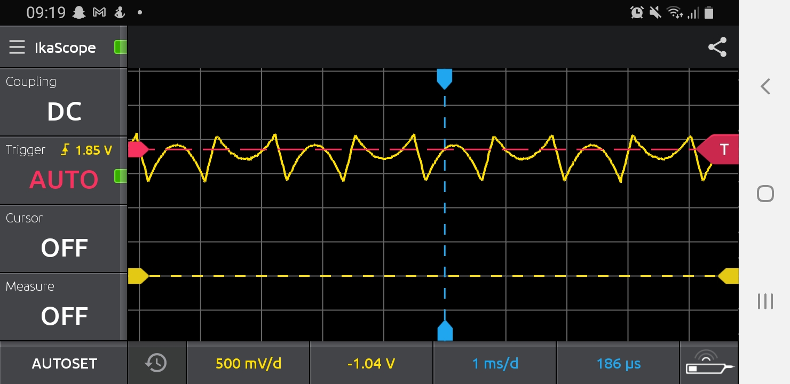

# Electronics2

All my work associated with the Electronics 2 module, year 2, Design Engineering at Imperial College London.

Note: As suggested by my previous tutor in Electronics 1, I aim to make concepts and topics easier to find within this repo for my assessed oral.

## Lab Objectives

#### Lab1 - Introduction to MATLAB

Link to notes: https://github.com/hannahjayneknight/Electronics2/blob/main/Lab1-IntroToMATLAB/notes-lab1.md  

Tasks:
1. Function that generates a sine signal.
2. Function that plots a frequency spectrum.
3. Comining two sine waves of different frequencies and amplitudes and plotting the resulting waveform and frequency spectrum.
4. As above (exercise 3) but with noise added.
5. **Projecting** signals onto one another using the dot product.  

 <nobr>

 <nobr>

 <nobr>

#### Lab2 - Signal Processing with PyBench & Matlab

Link to notes: https://github.com/hannahjayneknight/Electronics2/blob/main/Lab2-SignalProcessing/notes-lab2.md  

Tasks:
1. Check that Matlab on your computer is talking to PyBench hardware
2. Using PyBench to generate sine, square and triangular signals via Matlab.
3. Capture and plot signals from whistling. See the effect of changing the **sampling frequency** or **number of samples** collected. Used a while loop to continously plot the signal.
4. Plotting the microphone signal on a **logarithmic (dB) scale** and using a **Hamming window** to remove noise.
5. Plotting a music file consiting of drum beats. The peak amplitude of each beat was found.

 <nobr>
 
 <nobr>

 <nobr>

 <nobr>

